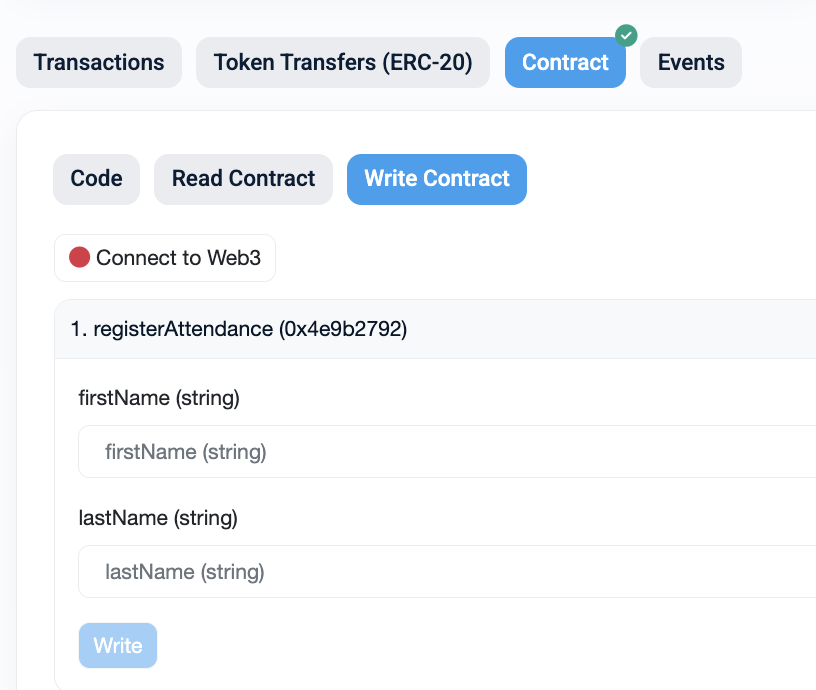
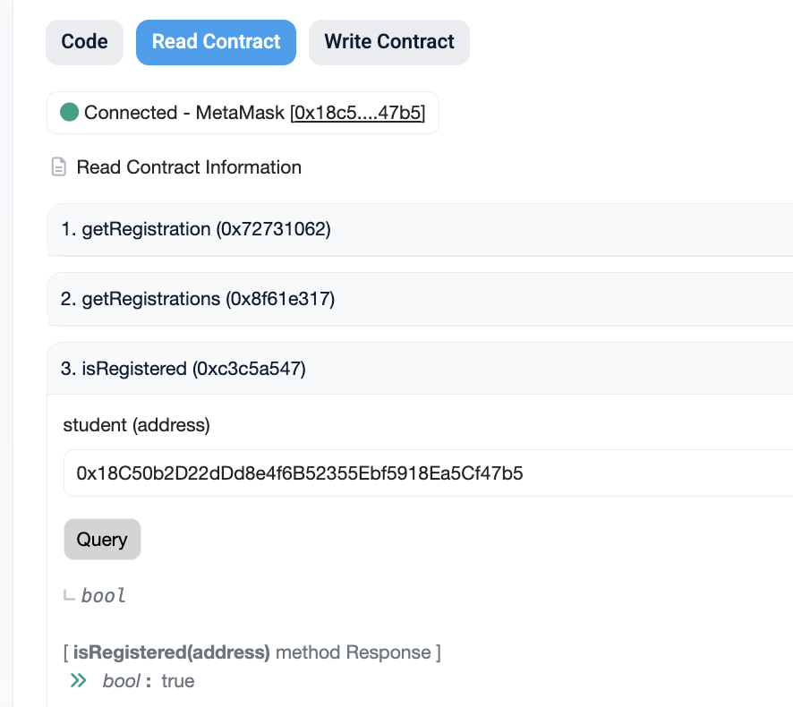

# Attendance (Arbitrum - Ethereum SC bridge interaction) (40p)

Objective: You need to register as class attendant with your name and wallet on Ethereum Sepolia. Use your FirstName and the first initial of the LastName.

<!--  -->

## Helpful info
* You need to "Connect to Web3";
* Fill the fields;
* Click on "Write" to submit the transaction;
* Your Metamask extension will pop up to confirm the transaction;

## Check your attendance

<!--  -->

* Go to "Read Contract" section;
* You don't need to be connected to wallet to read information from blockchain;
* You can query any information you want, but to check your attendance you should call "isRegistered" function with your wallet address.

## Given addresses
* ⁠ETH Sepolia explorer: https://sepolia.etherscan.io/
* ⁠⁠Arbitrum Sepolia explorer: https://sepolia.arbiscan.io/
* ⁠⁠Onboard SC Address (Sepolia Arbitrum): 0x80a79D9AC9806bc57e11Ff83BD362d1869c766b1
* ⁠⁠Bridge Address: https://bridge.arbitrum.io/?amount=0&destinationChain=sepolia&sourceChain=arbitrum-sepolia&tab=bridge