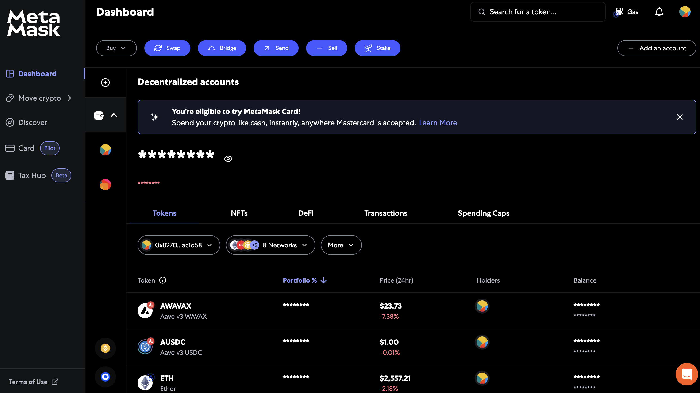
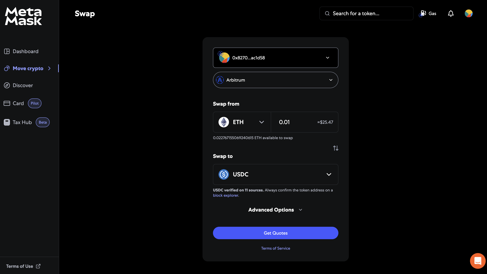
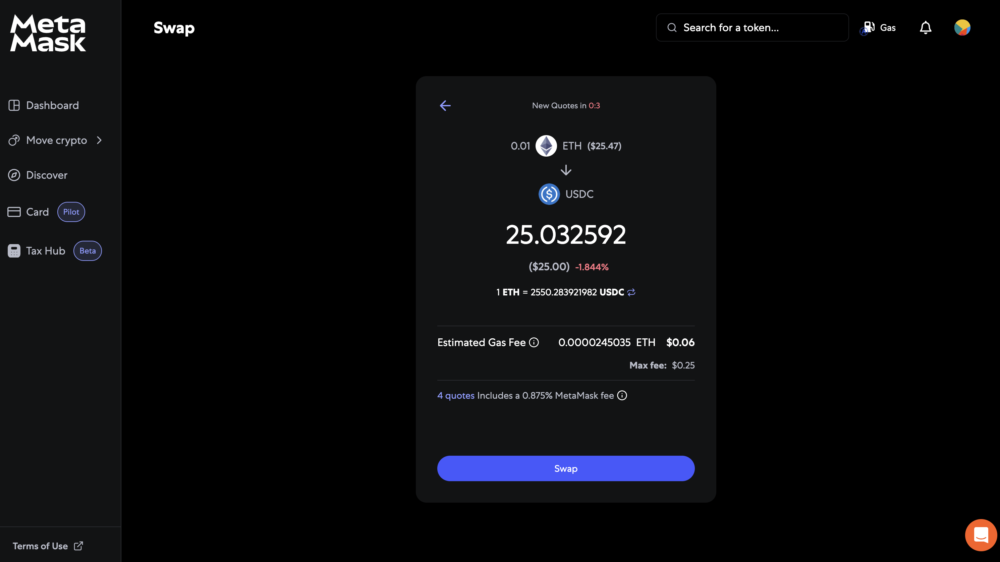

# Swap tokens via MetaMask

In this section, you will learn how to swap a token with another on Ethereum based blockchains. For this, we will use the [Metamask](https://portfolio.metamask.io/), wallet.

Use **Swap** to perfrom an exchange between two assets.

Notice the **Get quotes** button. This will query the Liquidity Pool of the two assets and get a quote.

Once you click the **Swap** button, a window with the transaction appears and you will need to sign the transaction.
