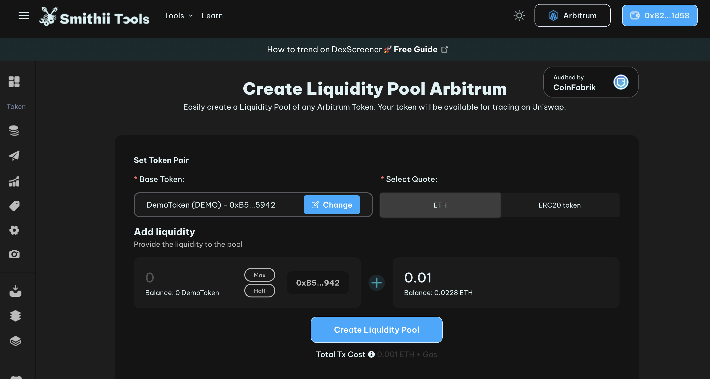
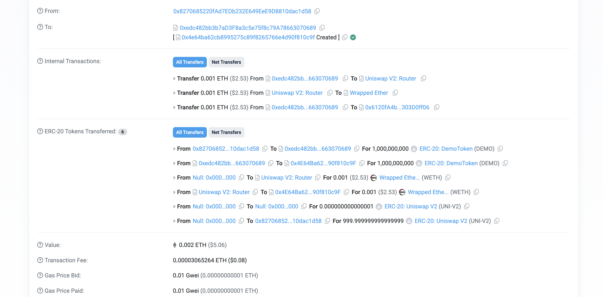
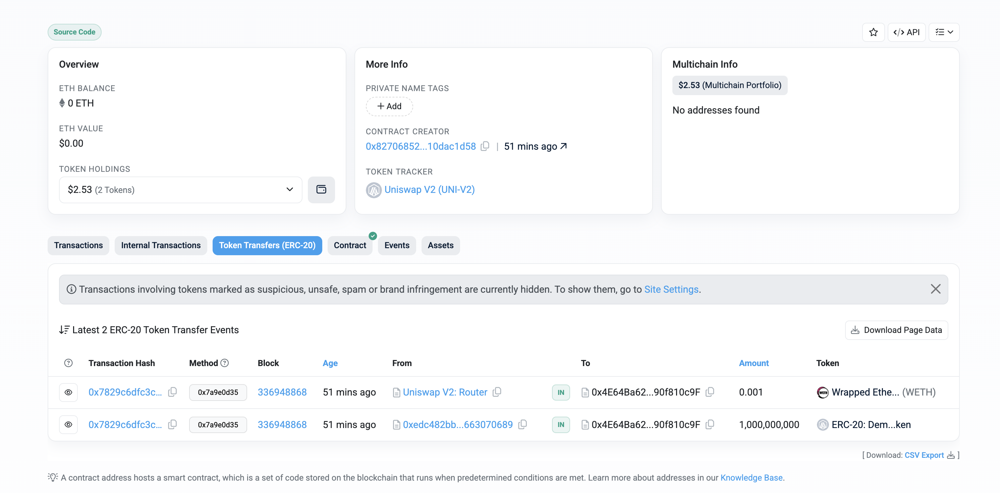

# Create a liquidity Pool on Ethereum based blockchains

In this section you will learn how to mint tokens on EVM based blockchains.
We will use [this](https://tools.smithii.io/liquidity-pool/arbitrum) decentralized applications (dApp).

Let's inspect the Interface:

Observe:
* Base Token - this is the token you want to assign a price;
* Select Quote - based on this token, you will get the quote of your token;
* Add liquidity - On the left-hand side is how much of your token will be delivered to the pool; On the right-hand side is how much of the second token will be delivered to the pool.

Press **Create Liquidity Pool** and sign the transaction.

Let's inspect the transaction. [Here](https://arbiscan.io/tx/0x7829c6dfc3c5fa47d9bd1f6a48e26fd3c076cf38d06c92b47a43c90d73e6e059) is my transaction if you want to inspect it on-chain.

Observe: 
* 1,000,000,000 DemoToken and 0.001 ETH were sent from my wallet to the Liquidity Pool smart contract;
* 0.002 ETH was the value of LP creation.

Let's inspect the [newly created smart contract](https://arbiscan.io/address/0x4e64ba62cb8995275c89f8265766e4d90f810c9f#tokentxns):

Observe that the smart contract now holds:
* 1,000,000,000 DemoToken
* 0.001 ETH