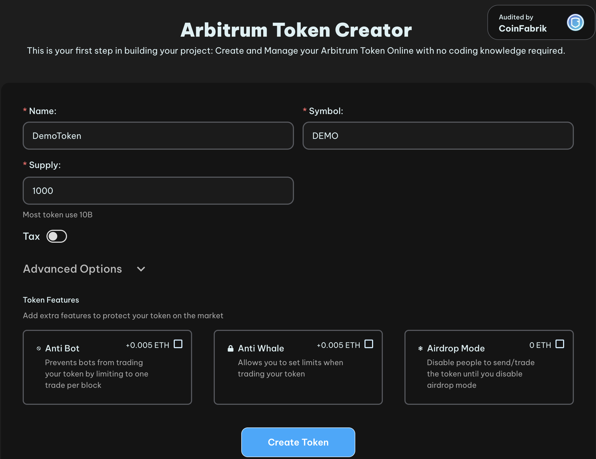

# Mint tokens on Ethereum based chains (EVM-based)

We will use [this](https://tools.smithii.io/) decentralized applications (dApp).
In this section you will learn how to mint tokens on EVM based blockchains.

## Mint ESDT

Click on the **Create Token** button and then fill the necessary fields.

Token Name:
* length between 2 and 20 characters
* alphanumeric characters only

Token Ticker:
* length between 2 and 10 characters
* alphanumeric UPPERCASE only

For this you will have to have Metamask wallet.
After clicking on **Create Token** button, a new pop-up window will appear for you to sign a message.

> ⚠️ **WARNING**: There are several types of attacks where a rogue transactions will be provided for you to sign. Read carefully what you are signing. Some of the transaction are hard to interpret so this will be a best effort check.

Let's inspect the transaction of token creation:

Observe:
* Transaction From - your wallet
* To - this is a contract that creates token. Just below the address of the newly created token is provided (ex: `0xb5211f55e7a6ecb3c21b101a51bed852780e5942`);
* `1,000,000,000 DEMO` transferred to your wallet.

You should see the tokens in your wallet.

## Practice

* Create your own ESDT token;
* Inspect the transaction.