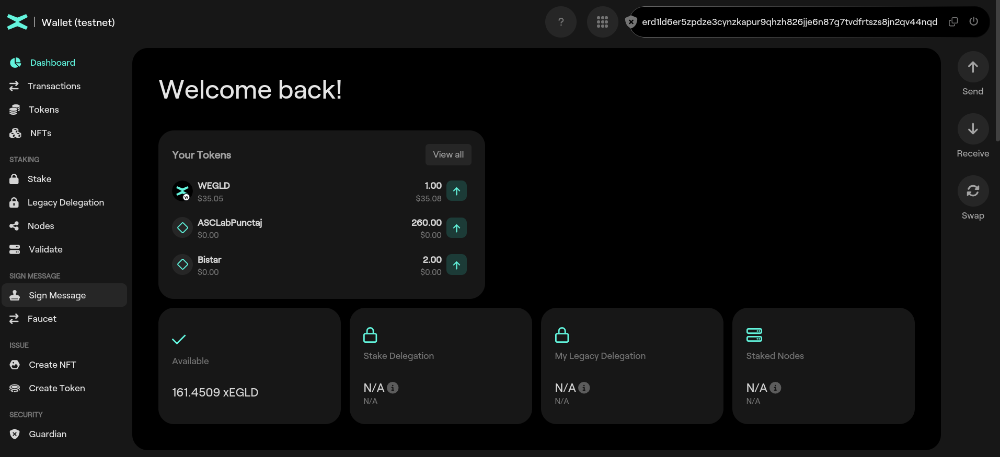
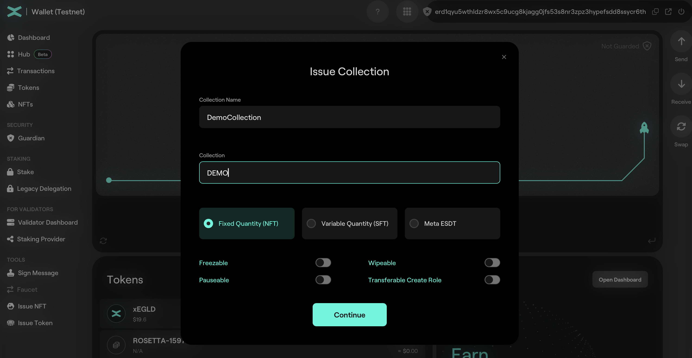
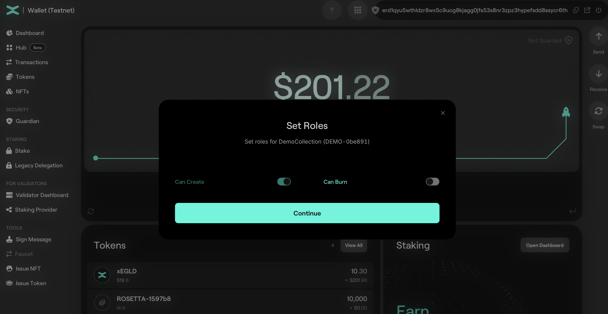
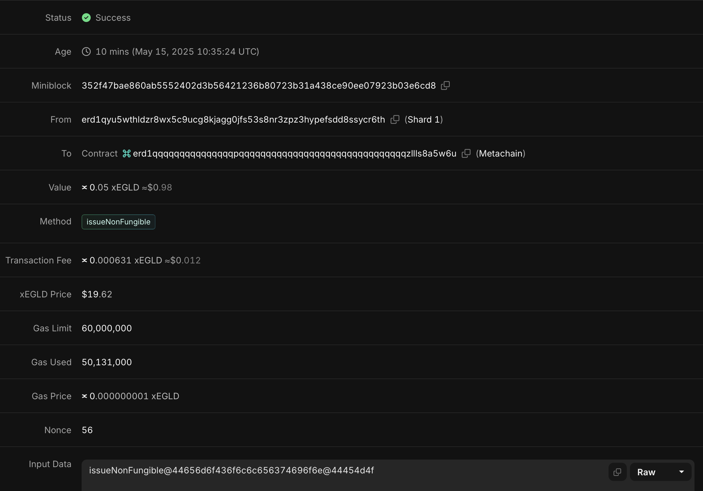
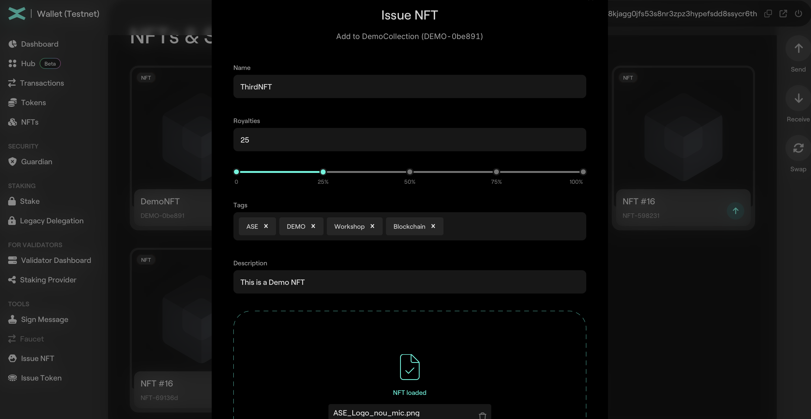
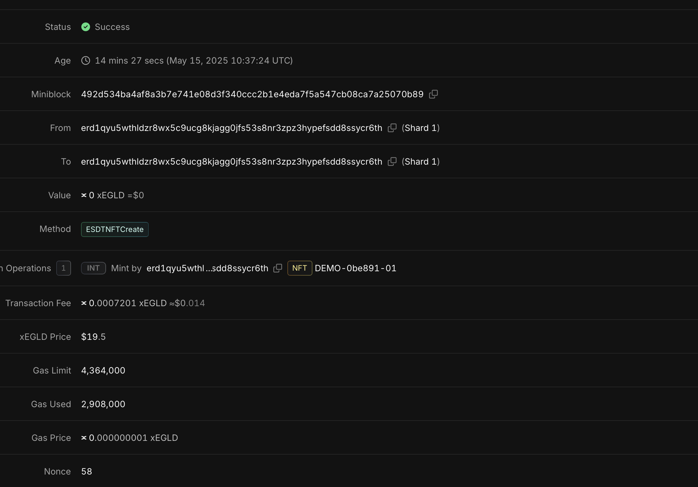
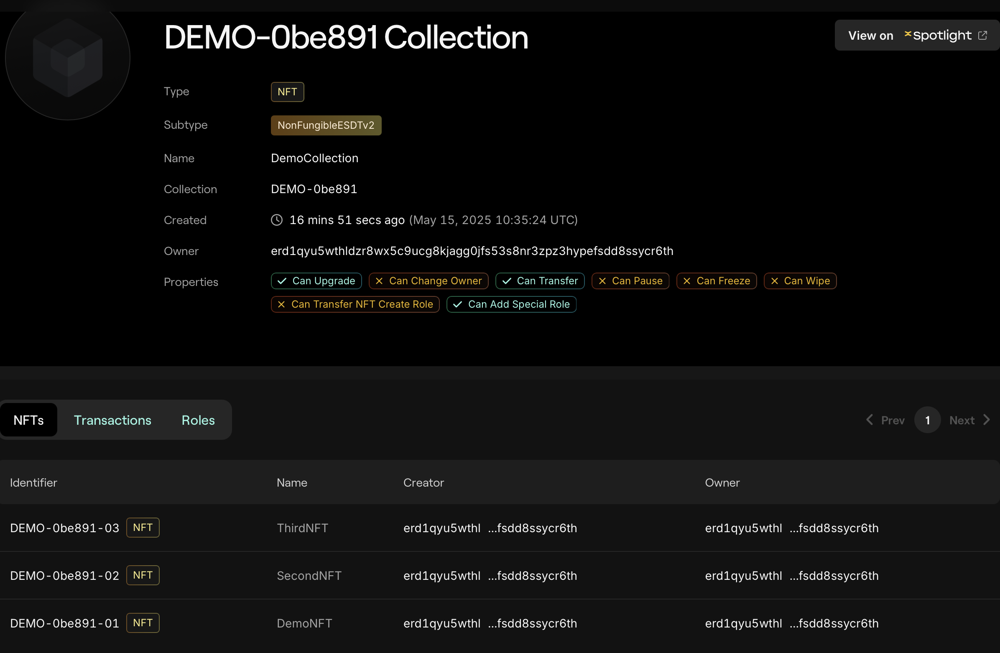

# Non Fungible Tokens (NFT)

## Issuance of Non Fungible ESDT tokens via Web Wallet on MultiversX

In this section you will learn how to mint tokens on MultiversX.

In the previous section you learnt how to mint xEGLD on [MultiversX Testnet](https://testnet-wallet.multiversx.com/) using `Faucet` option. This is needed to pay the gas.

### Create collection via Web Wallet

This time we use the `Issue NFT` option.

Collection Name:
* length between 3 and 20 characters
* alphanumeric characters only

Token Ticker:
* length between 3 and 10 characters
* alphanumeric UPPERCASE only

Let's create a token new NFT collection:

set the roles:

and inspect the transaction 

Observe that we didn't receive any tokens. This is because we created a collection. Is like we created an empty album with no photos inside.

### Create NFT inside a collection via Web Wallet

Let's create a NFT inside the collection we previously created. Use `Issue NFT` option and fill the required fileds:

Let's inspect the transaction:

Observe that we received a token `DEMO-0be891-01`. The `01` at the end is called **nonce**.

Let's inspect our collection:

Observe that we have 3 NFTs created inside the collection.

### Practice

* Create your own NFT collection;
* Inspect the transaction;
* Create 3 NFTs inside that collection;
* Send an NFT to **erd1qyu5wthldzr8wx5c9ucg8kjagg0jfs53s8nr3zpz3hypefsdd8ssycr6th**;

